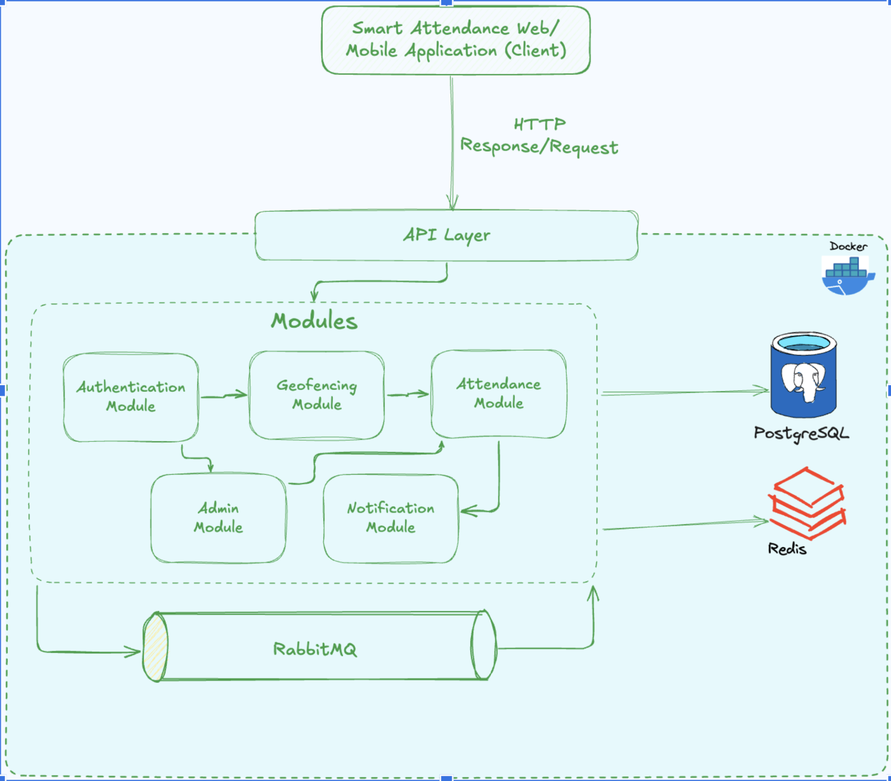
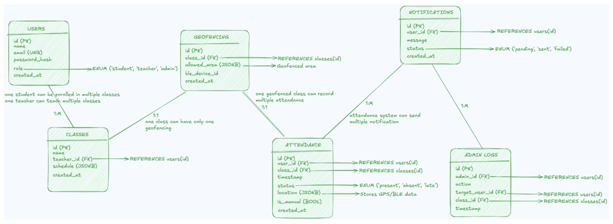
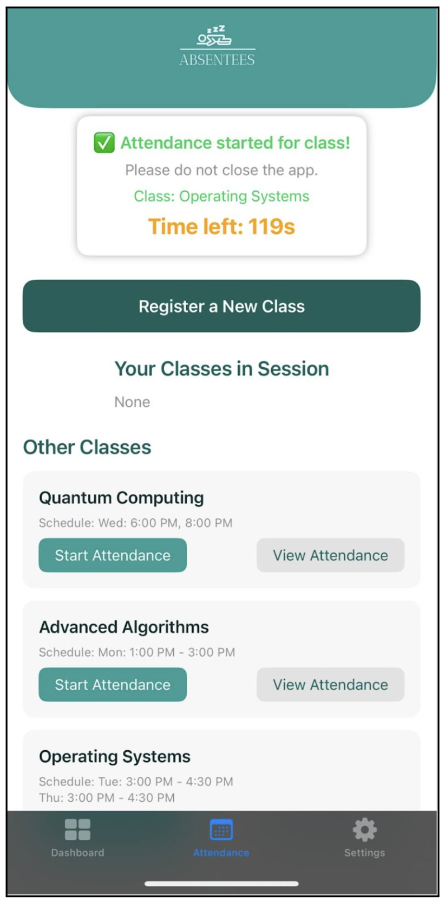
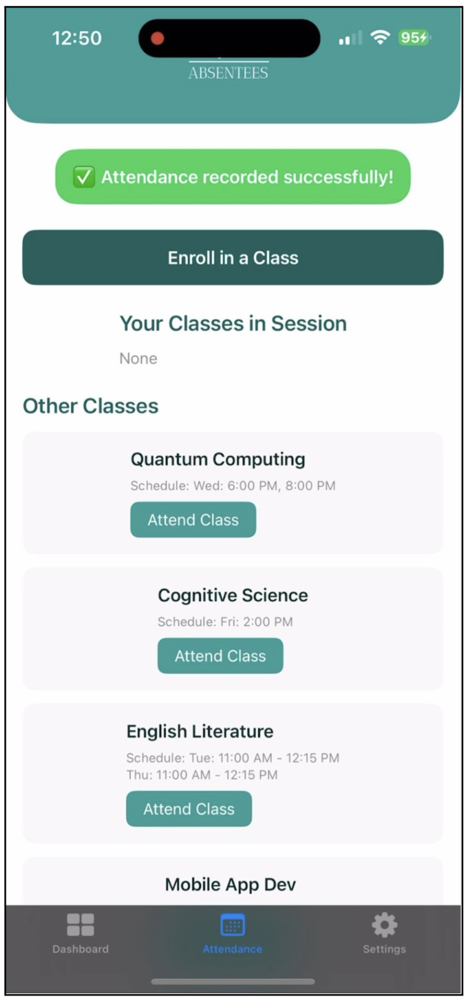
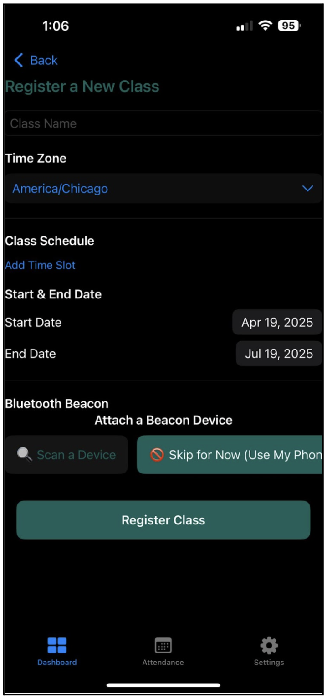
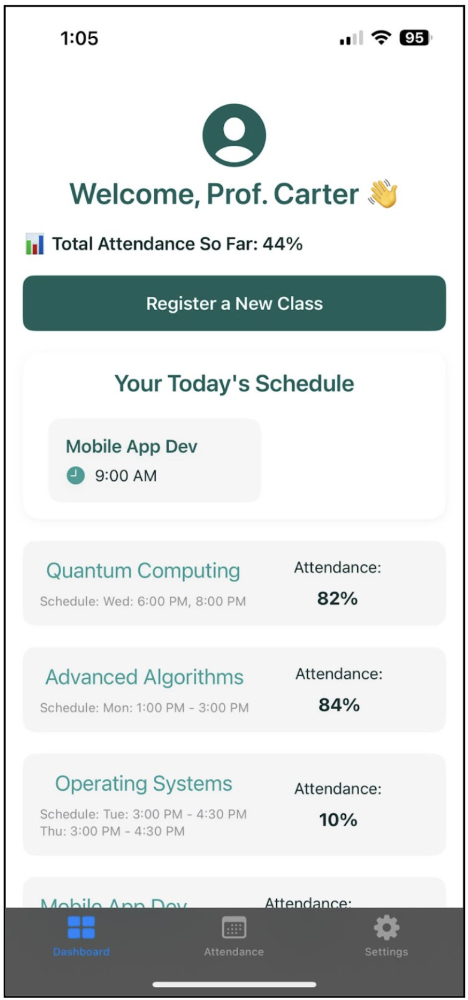
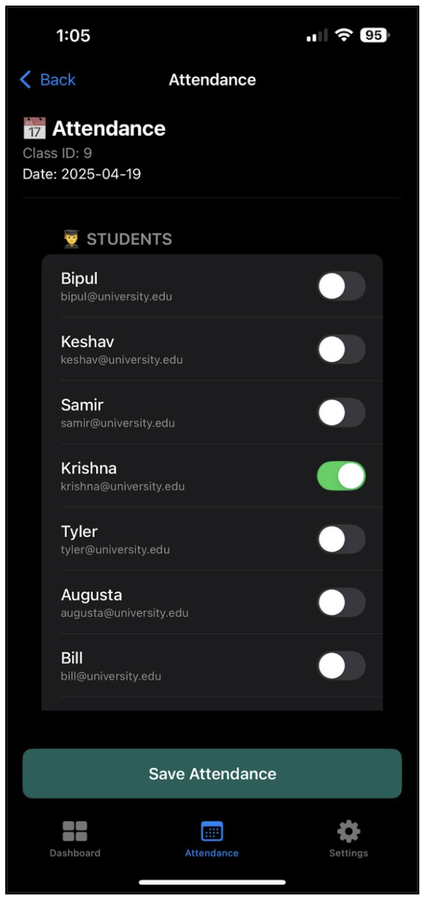

# 📱 Smart Attendance Tracker

---

## 📌 Summary
Attendance tracking in schools and colleges is often outdated—teachers still call roll, pass sign-in sheets, or use QR codes. These methods are **time-consuming, error-prone, and easy to fake** (e.g., proxy attendance or QR code sharing).  

**Smart Attendance Tracker** solves this by using **Bluetooth Low Energy (BLE) beacons** and **GPS geofencing** to verify whether students are physically present in class.  
- Students don’t have to press buttons or scan anything.  
- Teachers save valuable lecture time.  
- Administrators get **real-time, reliable, digital attendance data**.  

Built with:  
- **iOS mobile app (Swift)**  
- **Backend (Golang + PostgreSQL + Redis + RabbitMQ)**  
- **BLE beacon hardware**  
- **Admin dashboard (web)**  

---

## 🎯 Problem Background
- Manual and QR-based attendance systems are unreliable and prone to cheating.  
- Teachers waste class time managing attendance.  
- Schools cannot depend on inconsistent records for academic performance tracking.  

---

## 🚀 Goals
- Automate attendance using BLE + GPS.  
- Ensure accuracy and prevent fake check-ins.  
- Cross-platform support (iOS + Android planned).  
- Keep setup **affordable** and **simple**.  
- Provide teachers/admins with **real-time dashboards** and exportable reports.  

---

## 👥 Target Users
- **Students**: Fair, transparent, and accurate attendance.  
- **Teachers**: Time-saving, distraction-free lectures, and real-time insights.  
- **Administrators**: Centralized, digital attendance data for better decision-making.  

---

## 🛠️ System Architecture

  
  

The system follows a **modular monolith** design with four main components:  

1. **📱 iOS Mobile App (Swift)**  
   - Secure login (student/teacher roles)  
   - BLE-based check-in  
   - Real-time attendance updates  
   - Notifications for low attendance  
   - Personal attendance history  

2. **📡 BLE Beacon Integration**  
   - Beacons installed in classrooms broadcast unique IDs.  
   - Mobile app verifies presence against registered class beacon ID.  
   - Prevents spoofing with timestamp + device validation.  

3. **⚙️ Backend (Golang + PostgreSQL)**  
   - Authentication & role management (JWT-based)  
   - Attendance validation & storage  
   - Redis caching for fast lookups  
   - RabbitMQ for async tasks (notifications, logging)  
   - REST APIs for mobile + dashboard integration  

4. **📊 Admin/Teacher Dashboard**  
   - Real-time attendance view  
   - Manual correction with audit logs  
   - Attendance analytics & trends  
   - Export to CSV/PDF  

---

## 🔒 Security & Anti-Spoofing
- Unique beacon IDs per classroom.  
- Encrypted API calls with JWT session management.  
- Device info + timestamps logged for every check-in.  
- Role-based access control (students, teachers, admins).  

---

## 🧪 Testing & Evaluation
**Testing Approach**  
- Unit + integration testing (Go test framework, Postman).  
- Real-world device testing with iPhones + BLE beacons in classrooms.  
- Tested under poor signal strength, background states, and peak load.  

**Feedback Iterations**  
- Students: wanted confirmation pop-ups → ✅ Added success/failure alerts.  
- Teachers: requested reports & reminders → ✅ Added export + notification features.  
- Performance: Redis + RabbitMQ integration improved reliability under heavy load.  

---

## ⚡ Challenges & Solutions
- **Slow beacon detection** → Retry mechanism for consistent check-ins.  
- **Proxy check-ins outside class** → Unique beacon IDs + GPS validation.  
- **High load delays** → Redis caching + async processing with RabbitMQ.  
- **iOS background restrictions** → Optimized scan timing without battery drain.  

---

## 🔮 Future Enhancements
- **Silent background check-ins** (no app open required).  
- **Device fingerprinting** for added security.  
- **Gamification features** (attendance streaks, badges, points).  
- **Dedicated web dashboard** for easier admin access.  
- **Multi-beacon support** for large lecture halls.  

---

## 📷 Screenshots

  
  

  
  

  

---

## 📚 Tech Stack
- **Mobile App:** Swift (iOS)  
- **Backend:** Golang, Fiber framework  
- **Database:** PostgreSQL  
- **Caching:** Redis  
- **Messaging Queue:** RabbitMQ  
- **Frontend/Dashboard:** React (planned)  
- **Auth & Security:** JWT, Role-based access  

---
